<p align="center">
  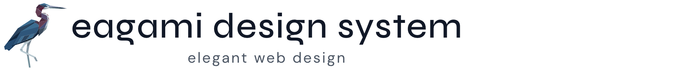
</p>

A lightweight, accessible Angular component library built on CSS custom properties. Ready to use out of the box — install, import, and start building.

Every component is standalone, signal-based, and fully themed via design tokens. No wrapping modules, no complex setup, no runtime style conflicts. Designed to be AI-friendly with clear APIs, consistent patterns, and comprehensive documentation that makes it easy for both developers and AI assistants to work with.

## Why @eagami/ui?

**Approx. component sizes (gzipped)¹**

| Component | **@eagami/ui** | Angular Material | PrimeNG | ng-bootstrap | ng-zorro |
|---|---|---|---|---|---|
| Button | ~2 KB | ~12 KB | ~8 KB | ~10 KB | ~18 KB |
| Input | ~4 KB | ~25 KB | ~14 KB | ~20 KB | ~35 KB |
| Checkbox | ~2 KB | ~15 KB | ~9 KB | ~12 KB | ~22 KB |
| Dropdown / Select | ~4 KB | ~30 KB | ~20 KB | ~25 KB | ~40 KB |
| Dialog / Modal | ~2 KB | ~20 KB | ~15 KB | ~18 KB | ~30 KB |

> ¹ Approximate — depends on configuration, tree-shaking, and Angular version. @eagami/ui sizes measured from production build.

| | **@eagami/ui** | Angular Material | PrimeNG | ng-bootstrap | ng-zorro |
|---|---|---|---|---|---|
| External CSS dependency | No | No | Optional | Bootstrap (~30 KB) | No |
| CSS custom property theming | Yes | Partial (MDC) | Yes | No (Sass vars) | No |
| Signals-first API | Yes | Partial | No | No | No |
| `OnPush` by default | Yes | Partial | No | No | No |
| Runtime dependencies | 0 | CDK + animations | PrimeIcons² | Bootstrap CSS | CDK |
> ² PrimeNG components are tree-shakable but PrimeIcons font (~50 KB) is typically included globally.

## Features

- **Zero configuration** — works immediately after install with sensible defaults
- **Standalone components** — no `NgModule` boilerplate, just import and use
- **Signal-based** — built on Angular's modern reactivity primitives (`input()`, `model()`, `output()`, `effect()`)
- **Full theming via CSS custom properties** — override any design token on `:root` or scope overrides to individual components
- **Dark mode built in** — automatic via `prefers-color-scheme`, no extra setup
- **Accessible** — ARIA attributes, keyboard navigation, focus management, and screen reader support throughout
- **Form-ready** — `ControlValueAccessor` on all form components (Input, Textarea, Checkbox, Switch, Radio, Dropdown)
- **Lightweight** — zero runtime dependencies beyond Angular
- **Tree-shakeable** — only the components you import end up in your bundle

## Installation

```bash
npm install @eagami/ui
# or
pnpm add @eagami/ui
```

Add the global stylesheet to your `angular.json` (or import it in your root SCSS):

```json
"styles": ["node_modules/@eagami/ui/src/styles/eagami-ui.scss"]
```

Load the fonts in your `index.html`:

```html
<link rel="preconnect" href="https://fonts.googleapis.com" />
<link rel="preconnect" href="https://fonts.gstatic.com" crossorigin />
<link rel="stylesheet" href="https://fonts.googleapis.com/css2?family=DM+Sans:ital,opsz,wght@0,9..40,300;0,9..40,400;0,9..40,500;0,9..40,600;1,9..40,400&family=Syne:wght@400;500;600;700&display=swap" />
```

## Quick start

```typescript
import { ButtonComponent } from '@eagami/ui';

@Component({
  imports: [ButtonComponent],
  template: `<ea-button variant="primary" (clicked)="save()">Save</ea-button>`,
})
export class MyComponent {
  save() { /* ... */ }
}
```

No modules to register, no providers to configure. Every component works the same way — import it, drop it in your template.

## Components

<details>
<summary><strong>Accordion</strong> — expandable content sections</summary>

Supports single or `multi` expand mode. Built-in chevron animation and disabled state.

```html
<ea-accordion>
  <ea-accordion-item label="Section 1">Content for section 1</ea-accordion-item>
  <ea-accordion-item label="Section 2">Content for section 2</ea-accordion-item>
</ea-accordion>
```

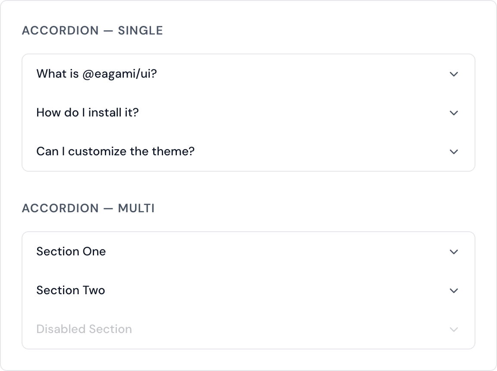

</details>

<details>
<summary><strong>Alert</strong> — semantic alert banners with optional dismiss</summary>

Variants: `default` | `success` | `warning` | `error` | `info`. Two-way `visible` binding.

```html
<ea-alert variant="success">Changes saved successfully.</ea-alert>
<ea-alert variant="error" [dismissible]="true">Something went wrong.</ea-alert>
```

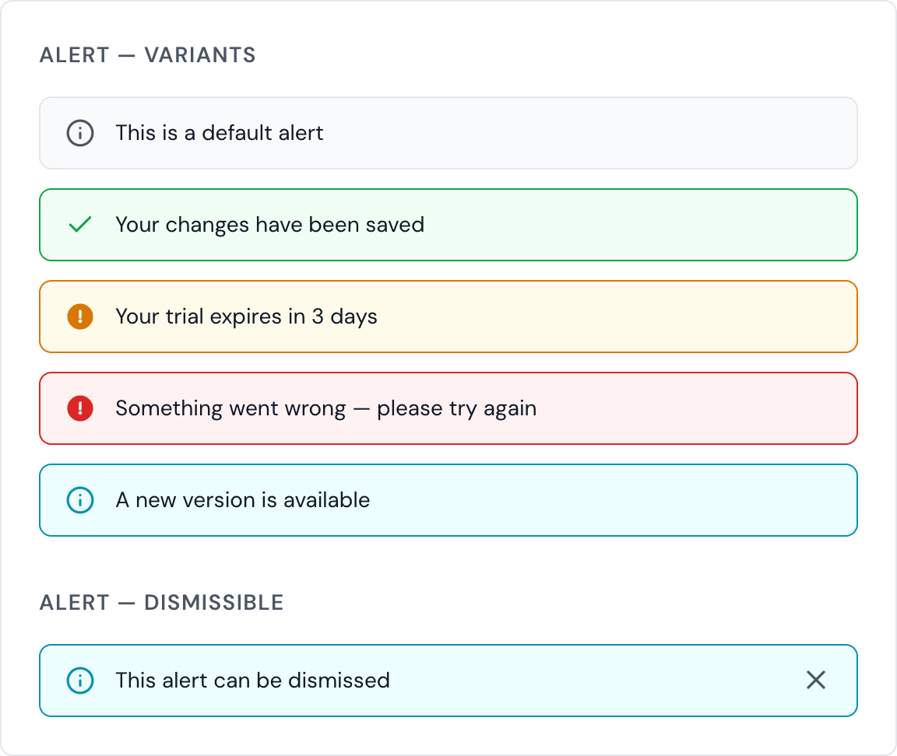

</details>

<details>
<summary><strong>Avatar</strong> — image with initials or icon fallback</summary>

Sizes: `xs` | `sm` | `md` | `lg` | `xl`. Shapes: `circle` | `square`.

```html
<ea-avatar src="/photo.jpg" alt="User" size="lg" />
<ea-avatar initials="MW" shape="square" />
<ea-avatar />  <!-- shows fallback user icon -->
```

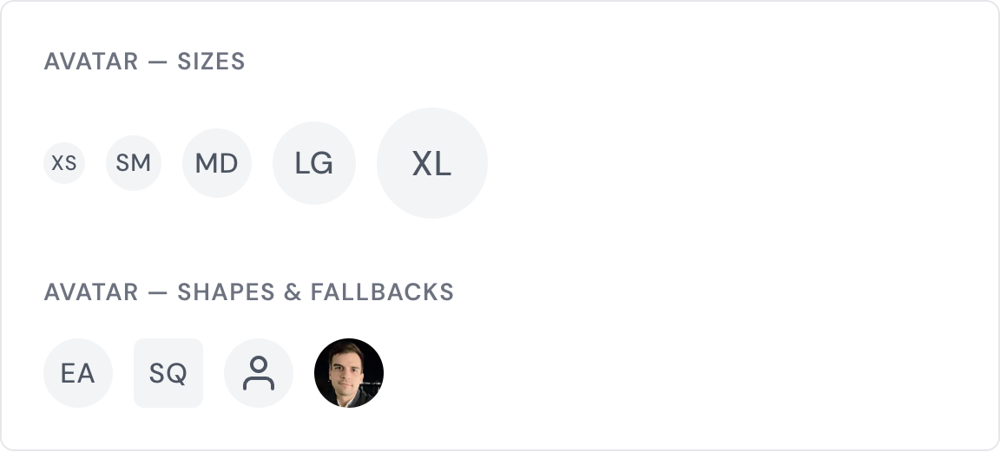

</details>

<details>
<summary><strong>Avatar Editor</strong> — canvas-based image editor with pan, zoom, and crop</summary>

Drag-and-drop upload, zoom via slider or scroll wheel. Outputs a `Blob` and data URL.

```html
<ea-avatar-editor
  shape="circle"
  [canvasSize]="200"
  (cropped)="onCropped($event)" />
```

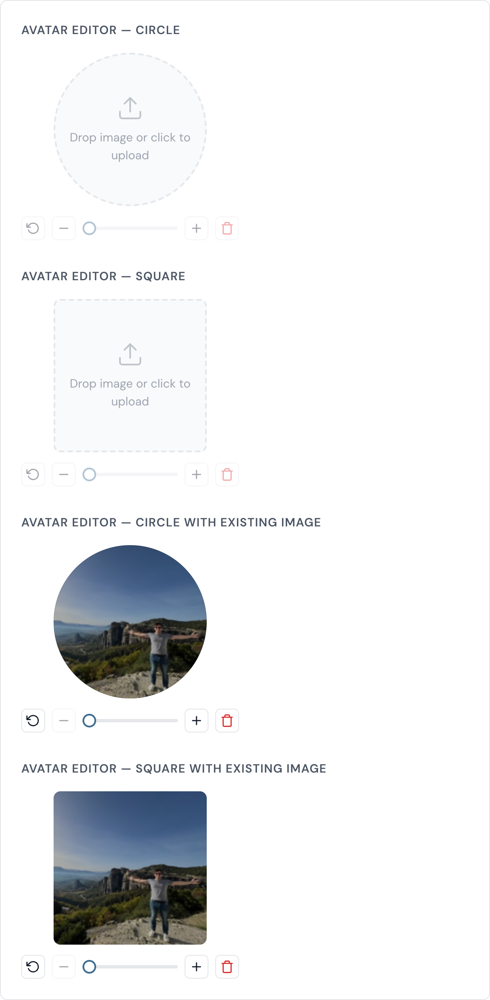

</details>

<details>
<summary><strong>Badge</strong> — semantic status indicators</summary>

Variants: `default` | `success` | `warning` | `error` | `info`. Sizes: `sm` | `md` | `lg`.

```html
<ea-badge variant="success">Active</ea-badge>
<ea-badge variant="error">Failed</ea-badge>
```

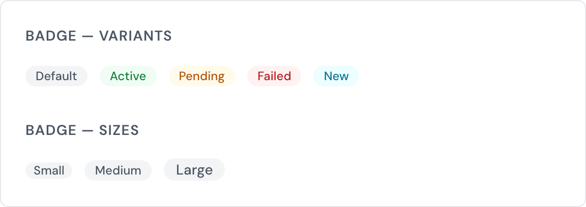

</details>

<details>
<summary><strong>Button</strong> — primary, secondary, ghost, danger variants with loading state</summary>

Sizes: `sm` | `md` | `lg`. Supports `loading`, `disabled`, and `fullWidth` states.

```html
<ea-button variant="primary" size="md" [loading]="isSaving" (clicked)="save()">
  Save changes
</ea-button>
```

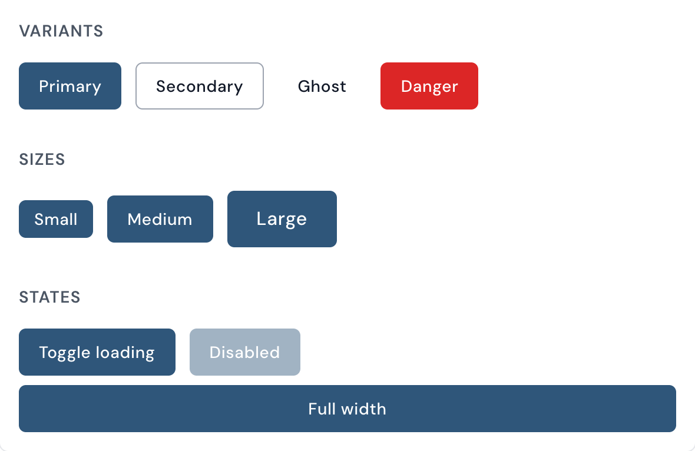

</details>

<details>
<summary><strong>Card</strong> — content container with elevated, outlined, and filled variants</summary>

Padding: `none` | `sm` | `md` | `lg` | `xl`. Customizable shadow via `--ea-card-shadow`.

```html
<ea-card variant="elevated">
  <span eaCardHeader>Card Title</span>
  Card body content goes here.
  <span eaCardFooter>
    <ea-button variant="secondary" size="sm">Cancel</ea-button>
    <ea-button size="sm">Save</ea-button>
  </span>
</ea-card>
```

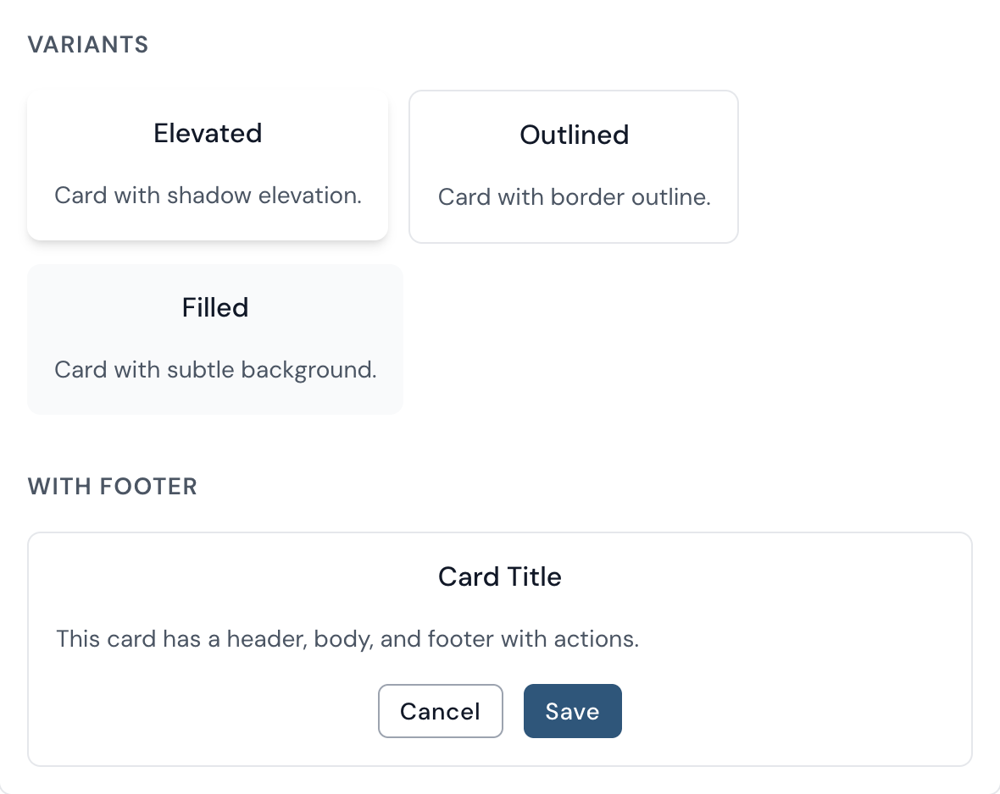

</details>

<details>
<summary><strong>Checkbox</strong> — with indeterminate state and ControlValueAccessor</summary>

Sizes: `sm` | `md` | `lg`.

```html
<ea-checkbox label="Accept terms and conditions" [(checked)]="accepted" />
```

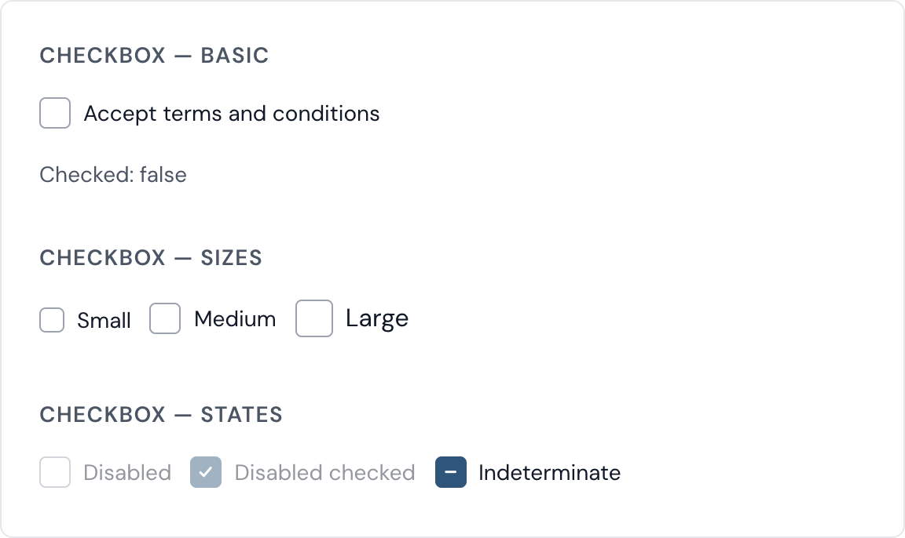

</details>

<details>
<summary><strong>Code Input</strong> — verification code entry with auto-advance and paste support</summary>

Configurable `length` (default 6). Full `ControlValueAccessor` support.

```html
<ea-code-input [(value)]="code" [length]="6" (completed)="verify()" />
```

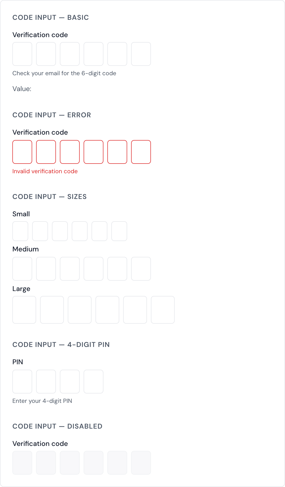

</details>

<details>
<summary><strong>Data Table</strong> — sortable columns, sticky headers, density modes</summary>

Striped, bordered, and hoverable rows. Custom cell templates via `ng-template`. Density: `compact` | `comfortable` | `spacious`. Two-way `sort` binding.

```html
<ea-data-table
  [columns]="columns"
  [data]="users"
  [stickyHeader]="true"
  [striped]="true"
  [(sort)]="sortState"
  trackBy="id" />
```

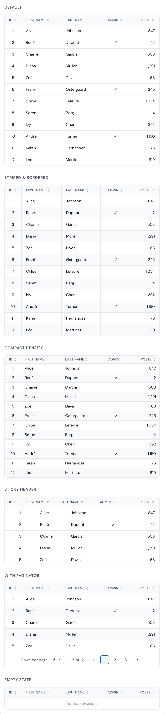

</details>

<details>
<summary><strong>Dialog</strong> — native dialog element with focus trapping</summary>

Sizes: `sm` | `md` | `lg` | `full`. Two-way `open` binding.

```html
<ea-button (clicked)="dialogOpen.set(true)">Open</ea-button>

<ea-dialog [(open)]="dialogOpen" size="md">
  <span slot="header">Confirm</span>
  <p>Are you sure?</p>
  <span slot="footer">
    <ea-button variant="secondary" (clicked)="dialogOpen.set(false)">Cancel</ea-button>
    <ea-button (clicked)="confirm()">Confirm</ea-button>
  </span>
</ea-dialog>
```

</details>

<details>
<summary><strong>Divider</strong> — visual separator with optional label</summary>

Orientation: `horizontal` | `vertical`.

```html
<ea-divider />
<ea-divider label="or" />
<ea-divider orientation="vertical" />
```

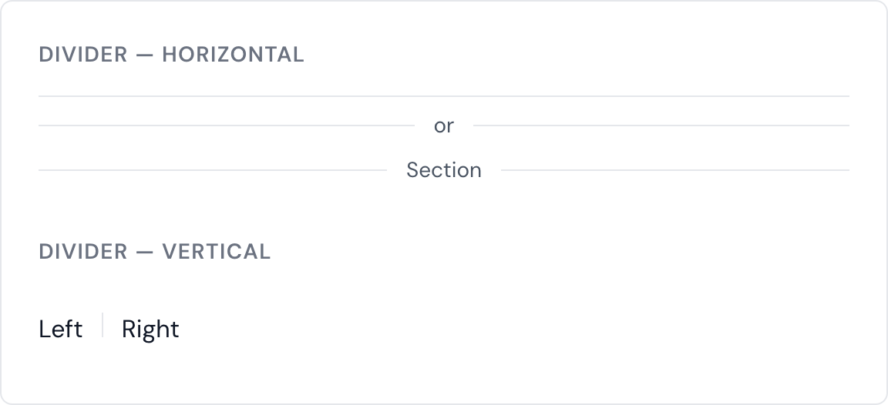

</details>

<details>
<summary><strong>Dropdown</strong> — select with ControlValueAccessor and keyboard navigation</summary>

Arrow keys, Enter/Space to select, Escape to close. Sizes: `sm` | `md` | `lg`.

```html
<ea-dropdown
  label="Country"
  placeholder="Select a country…"
  [options]="countries"
  [(value)]="selectedCountry" />
```

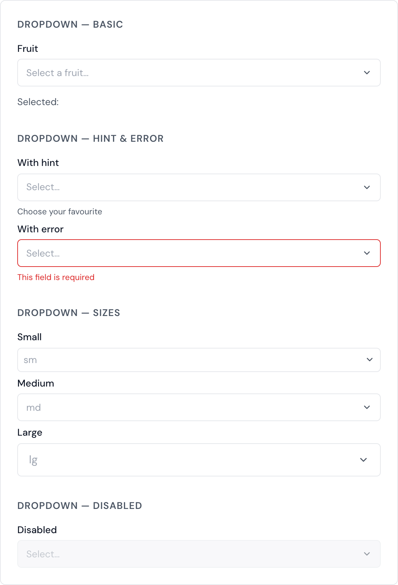

</details>

<details>
<summary><strong>Input</strong> — text field with ControlValueAccessor and password toggle</summary>

Types: `text` | `email` | `password` | `number` | `search` | `tel` | `url`. Sizes: `sm` | `md` | `lg`.

```html
<ea-input
  label="Email"
  type="email"
  placeholder="you@example.com"
  hint="We'll never share your email"
  [(value)]="email" />
```

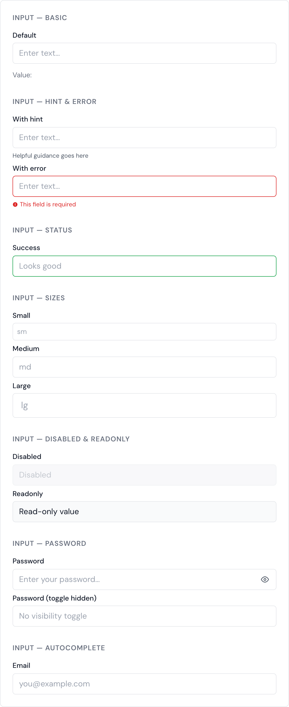

</details>

<details>
<summary><strong>Paginator</strong> — page navigation with configurable page sizes</summary>

Placement: `left` | `center` | `right`. Emits `pageChange` events with current page, page size, and total.

```html
<ea-paginator
  [total]="100"
  [pageSize]="10"
  placement="center"
  (pageChange)="onPageChange($event)" />
```

</details>

<details>
<summary><strong>Progress Bar</strong> — determinate and indeterminate linear indicator</summary>

Variants: `default` | `success` | `warning` | `error` | `info`. Sizes: `sm` | `md` | `lg`. Optional `label` and `showValue` display.

```html
<ea-progress-bar [value]="72" label="Uploading" [showValue]="true" />
<ea-progress-bar variant="success" [value]="100" />
<ea-progress-bar [indeterminate]="true" label="Processing…" />
```

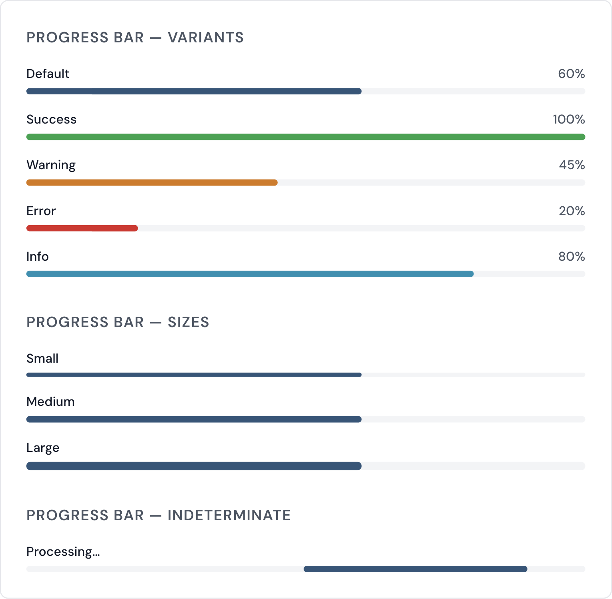

</details>

<details>
<summary><strong>Radio Group</strong> — composite pattern with ControlValueAccessor</summary>

Supports `vertical` and `horizontal` orientation. Sizes: `sm` | `md` | `lg`.

```html
<ea-radio-group [(value)]="plan">
  <ea-radio value="free" label="Free" />
  <ea-radio value="pro" label="Pro" />
  <ea-radio value="enterprise" label="Enterprise" />
</ea-radio-group>
```

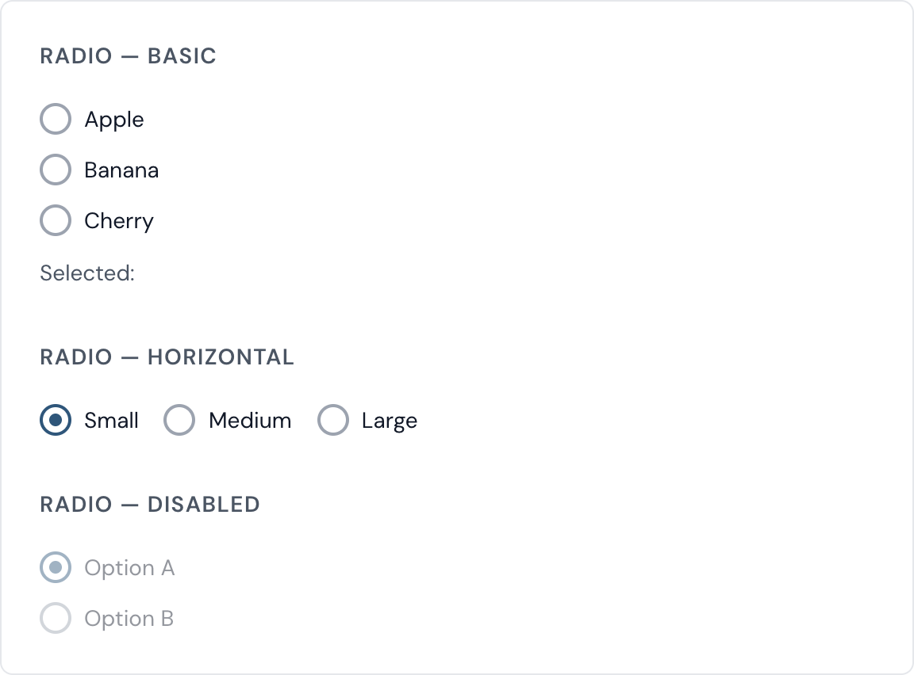

</details>

<details>
<summary><strong>Skeleton</strong> — loading placeholder with animated pulse</summary>

Variants: `text` | `circle` | `rect`. Custom `width` and `height`. Respects `prefers-reduced-motion`.

```html
<ea-skeleton variant="text" width="200px" />
<ea-skeleton variant="circle" width="48px" height="48px" />
<ea-skeleton variant="rect" width="100%" height="120px" />
```

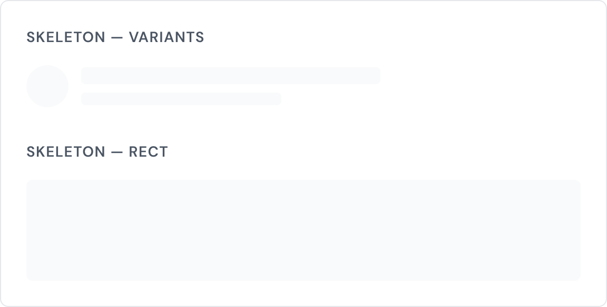

</details>

<details>
<summary><strong>Spinner</strong> — SVG loading indicator with accessible role</summary>

Sizes: `sm` | `md` | `lg`.

```html
<ea-spinner size="md" label="Loading data" />
```

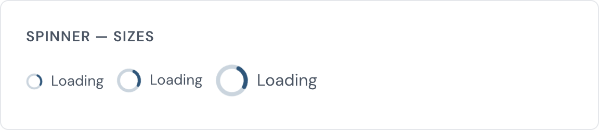

</details>

<details>
<summary><strong>Switch</strong> — toggle with ControlValueAccessor</summary>

Sizes: `sm` | `md` | `lg`.

```html
<ea-switch label="Enable notifications" [(checked)]="notificationsOn" />
```

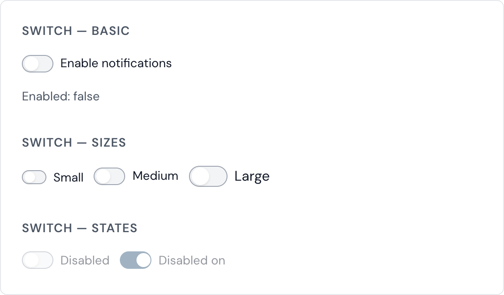

</details>

<details>
<summary><strong>Tabs</strong> — tab navigation with keyboard support</summary>

Variants: `underline` | `filled`. Sizes: `sm` | `md` | `lg`.

```html
<ea-tabs activeTab="account" variant="underline">
  <ea-tab value="account" label="Account">Account content</ea-tab>
  <ea-tab value="security" label="Security">Security content</ea-tab>
</ea-tabs>
```

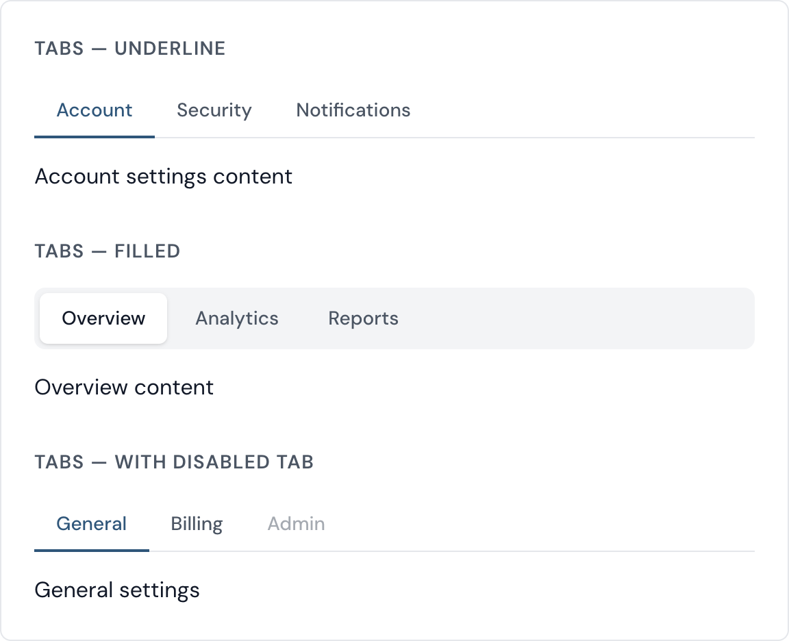

</details>

<details>
<summary><strong>Tag</strong> — inline label with optional remove button</summary>

Variants: `default` | `primary` | `success` | `warning` | `error` | `info`. Sizes: `sm` | `md` | `lg`.

```html
<ea-tag variant="primary">TypeScript</ea-tag>
<ea-tag variant="success" [removable]="true" (removed)="onRemove()">Active</ea-tag>
```

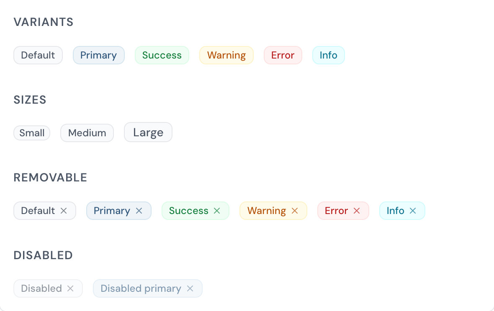

</details>

<details>
<summary><strong>Textarea</strong> — multiline text with ControlValueAccessor</summary>

Mirrors the Input API. Configurable `rows`, `resize` (`none` | `vertical` | `horizontal` | `both`), and `maxlength`.

```html
<ea-textarea
  label="Message"
  placeholder="Enter your message…"
  hint="Maximum 500 characters"
  [rows]="4"
  [(value)]="message" />
```

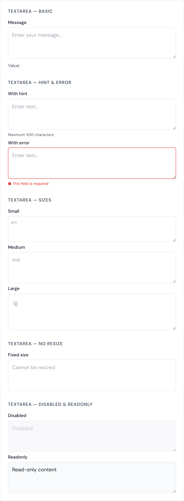

</details>

<details>
<summary><strong>Toast</strong> — notification system via injectable ToastService</summary>

Variants: `default` | `success` | `warning` | `error` | `info`. Auto-dismiss with configurable duration. Full-width on mobile, independent widths on desktop.

```typescript
import { ToastService } from '@eagami/ui';

export class MyComponent {
  private toast = inject(ToastService);

  save() {
    this.toast.success('Changes saved');
  }

  handleError() {
    this.toast.error('Something went wrong');
  }
}
```

Add the toast outlet once in your root template:

```html
<ea-toast />
```

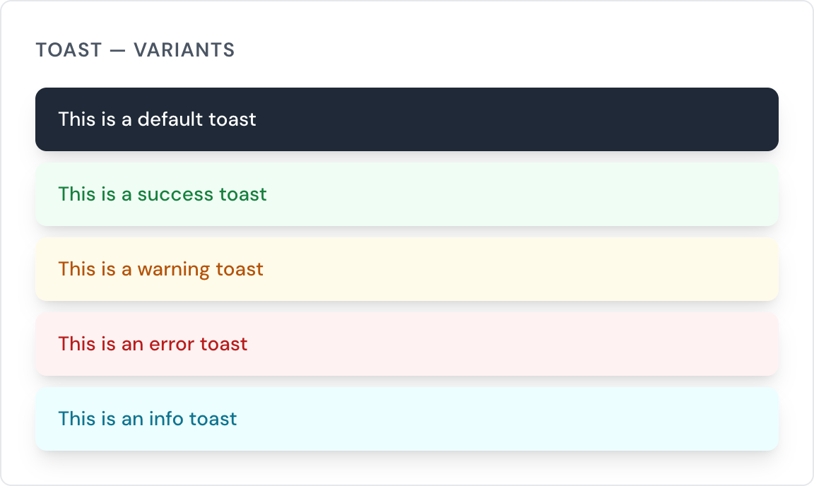

</details>

<details>
<summary><strong>Tooltip</strong> — positioned tooltip on hover and focus</summary>

Positions: `top` | `bottom` | `left` | `right`.

```html
<ea-button eaTooltip="Save your changes" tooltipPosition="top">Save</ea-button>
```

</details>

## Icons

<details>
<summary><strong>51 built-in SVG icon components</strong> — Feather-style (24x24, stroke-based, inherits <code>currentColor</code>)</summary>

| Tag | Preview |
|---|---|
| `<ea-icon-alert-circle />` |  |
| `<ea-icon-alert-triangle />` |  |
| `<ea-icon-apple />` |  |
| `<ea-icon-arrow-down />` | 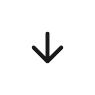 |
| `<ea-icon-arrow-left />` | 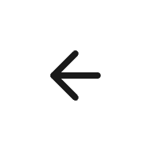 |
| `<ea-icon-arrow-right />` | 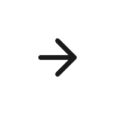 |
| `<ea-icon-arrow-up />` | 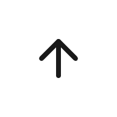 |
| `<ea-icon-bell />` |  |
| `<ea-icon-calendar />` |  |
| `<ea-icon-camera />` |  |
| `<ea-icon-check />` |  |
| `<ea-icon-check-circle />` |  |
| `<ea-icon-chevron-down />` |  |
| `<ea-icon-chevron-left />` |  |
| `<ea-icon-chevron-right />` |  |
| `<ea-icon-chevron-up />` |  |
| `<ea-icon-chevrons-up-down />` |  |
| `<ea-icon-clock />` |  |
| `<ea-icon-copy />` |  |
| `<ea-icon-download />` |  |
| `<ea-icon-external-link />` |  |
| `<ea-icon-eye />` |  |
| `<ea-icon-eye-off />` |  |
| `<ea-icon-facebook />` |  |
| `<ea-icon-file />` |  |
| `<ea-icon-filter />` |  |
| `<ea-icon-github />` |  |
| `<ea-icon-google />` |  |
| `<ea-icon-heart />` |  |
| `<ea-icon-image />` |  |
| `<ea-icon-info />` |  |
| `<ea-icon-link />` |  |
| `<ea-icon-loader />` |  |
| `<ea-icon-log-out />` | 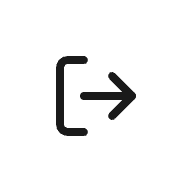 |
| `<ea-icon-mail />` |  |
| `<ea-icon-menu />` |  |
| `<ea-icon-microsoft />` |  |
| `<ea-icon-minus />` |  |
| `<ea-icon-more-horizontal />` |  |
| `<ea-icon-pencil />` |  |
| `<ea-icon-plus />` |  |
| `<ea-icon-rotate-ccw />` |  |
| `<ea-icon-search />` |  |
| `<ea-icon-settings />` |  |
| `<ea-icon-star />` |  |
| `<ea-icon-trash />` |  |
| `<ea-icon-upload />` |  |
| `<ea-icon-user />` |  |
| `<ea-icon-x />` |  |
| `<ea-icon-x-circle />` |  |
| `<ea-icon-x-twitter />` |  |

</details>

## Theming

All visual properties are controlled through CSS custom properties defined on `:root`. Override any token to customize the entire library:

```css
:root {
  --color-primary-600: #2563eb;
  --font-family-sans: 'Inter', sans-serif;
  --radius-md: 0.5rem;
}
```

Component-level overrides are available where useful:

```css
.my-card {
  --ea-card-shadow: 0 8px 32px rgba(0, 0, 0, 0.12);
  --ea-button-font-weight: 600;
}
```

See [`src/styles/tokens/`](src/styles/tokens/) for the full token reference.

## Peer dependencies

| Package | Version |
|---------|---------|
| `@angular/common` | `^21.0.0` |
| `@angular/core` | `^21.0.0` |
| `@angular/forms` | `^21.0.0` |

## Development

```bash
pnpm install       # Install dependencies
pnpm start         # Run sandbox dev app
pnpm storybook     # Run Storybook
pnpm test          # Run tests
pnpm build         # Build the library
pnpm lint          # Lint
```

## License

MIT
